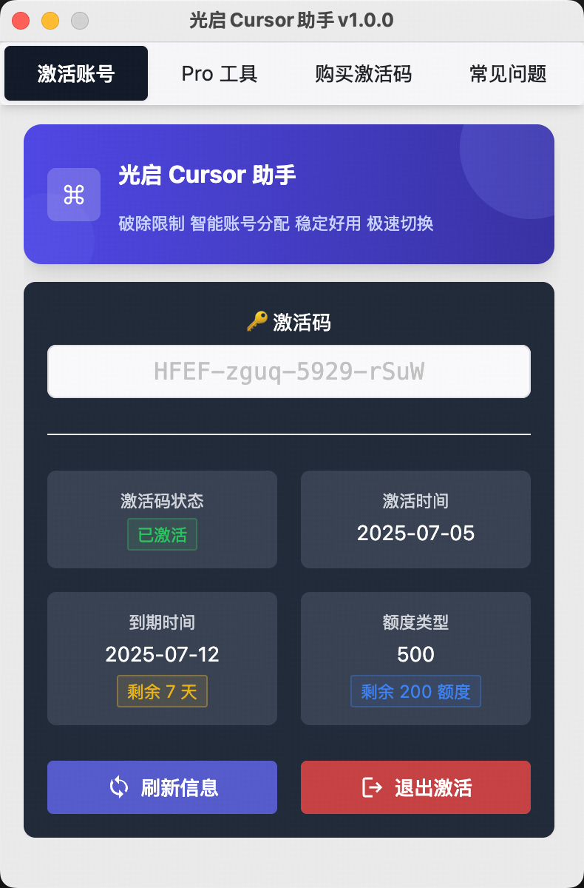

# 🚀 Guangqi Cursor VIP Assistant [Repository still available and working]

Stable and available on all platforms, **unlimited device login + ultra-fast account switching + unlimited renewals**, giving you a truly efficient and smooth Cursor experience!

[简体中文](./README.md) | English

## ✨ Product Highlights

| Features                 | Description                                            |
| ---------------------- | ----------------------------------------------- |
| ✅ Unlimited device login        | Log in to multiple devices simultaneously, no need for frequent re-verification or being kicked offline    |
| ⚡ 2-second fast account switching        | Supported by self-developed technology, one-click account switching, quick access without waiting      |
| 🔁 Unlimited renewals            | $3.9 renewal, uninterrupted account access, continuous efficient experience              |
| 🧍 Exclusive accounts            | All accounts are **one per person**, not shared chaos, purer experience |
| 🧩 Support for all Cursor versions  | Latest **0.x / 1.x** fully compatible, maximum compatibility         |
| 🖥️ All platform support          | Stable operation on Windows / macOS series operating systems          |
| 🛠️ No registration required / One-click start | No need to register or bind any account, ready to use out of the box              |

## 📸 Screenshots

| Information Page            | Pro Tools Page        | WeChat Group QR Code        |
| ------------------- | ------------------- | ----------------------- |
|  |  |  |

## 🪧 If you're hesitant, check out this letter
<a href="https://gleijfm8le.feishu.cn/docx/WBVCdkHcDozuFqxygWFcOY6hnJf#Vezyd8Sj5ope52xXGRNcuKDTnTh" target="_blank">👉 Click here to read our letter to you 💌</a>

## 🧩 Installation (Super Easy)

> This assistant is a standalone application, no browser plugins required, no complex configuration, 👉 [View complete update history](./CHANGELOG.md).

### ✅ Windows

1. Download the latest version: [📥 Click to download Windows version](https://gleijfm8le.feishu.cn/docx/WBVCdkHcDozuFqxygWFcOY6hnJf)
2. Extract and run
3. One-click account switching, enjoy the Cursor ultra-fast experience!

### ✅ macOS

1. Download the latest version: [📥 Click to download macOS version](https://gleijfm8le.feishu.cn/docx/WBVCdkHcDozuFqxygWFcOY6hnJf)
2. Allow execution permissions, double-click to run
3. Clean interface, one-click use!

## 📌 Usage Notes

- Guangqi VIP Assistant is only used to assist with fast login and account switching for Cursor software.
- All accounts are self-developed platform-specific accounts, **reselling or redistribution is prohibited**. 